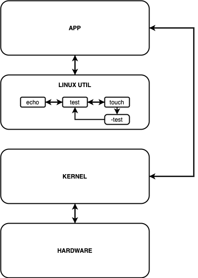

# Detailed Design Document
By Tigerlilly Zietz, Josh Seaman, and Nick Morgan.

## 2.1 – Detailed list of Linux modules that will be modified/affected
* `touch`: This modification would be added to the touch module. Using `-test` after typing the name of the new file will now test if the file already exists, and if not, creates a new file with the given name, and if it does already exist, prints an informative message in the same step.
* `echo`: This will not be affected, but it will be useful in the creation of this new utility. The inspiration for our modifications will likely come from the existing code in the built-in `echo` method.
* `test`: This will not be affected, but it will be useful in the creation of this new utility. The inspiration for our modifications will likely come from the existing code in the built-in `test` method.

## 2.2 – Detailed list of any new modules that you will produce [or 'Not Applicable' if there are none]
Not Applicable.

## 2.3 – Class diagram showing affected modules [and any new modules] and how they related to one another
#

## 2.4 – List or table of explanations of all command line options that will be implemented

| Command Line Options               | Explanation |
|------------------------------------|------------------------------------------------------------------------------------|
| `test -f <file_name>`              | Tests if a file with the name `file_name` exists in the current directory. |
| `echo <string>`                    | Outputs and prints the string, `string`, taken as an argument.  |
| `touch <file_name> -test`          | Tests if a file with the name `file_name` exists in the current directory and if so, prints "File already exists", and if not, creates a new file with the name `file_name`. |
